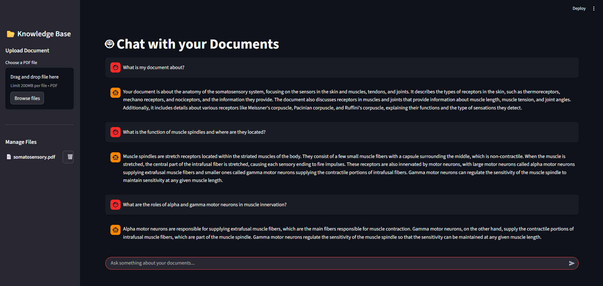

# 🤖 Local RAG PDF Assistant (Microsoft Phi-3)

A privacy-focused, local Retrieval-Augmented Generation (RAG) system that allows you to chat with your PDF documents. Everything runs **100% locally** on your machine using **Microsoft Phi-3** and **NVIDIA GPU acceleration**.

<p align="center">
  
</p>


## 🚀 Key Features
* **Total Privacy**: No data leaves your machine. The LLM runs locally via HuggingFace.
* **GPU Accelerated**: Optimized for NVIDIA GPUs (4GB+ VRAM) using CUDA for fast response times.
* **Knowledge Base Management**: Add, view, and delete documents directly from the Sidebar UI.
* **Modern Tech Stack**: Built with Python 3.13, LangChain, and Streamlit.
* **Docker Ready**: Easily deployable using the included Docker and Docker Compose configurations.

## 🧠 How It Works

This application follows a standard RAG (Retrieval-Augmented Generation) pipeline to provide accurate answers based on your documents:

1.  **Document Ingestion**: PDF files are loaded and split into smaller chunks using `PyPDFLoader`.
2.  **Vector Embedding**: Each chunk is converted into a numerical vector using the `BGE-M3` model and stored in a local **ChromaDB**.
3.  **Retrieval**: When you ask a question, the system searches the database for the most relevant text fragments.
4.  **Reranking**: The retrieved chunks are re-scored by the **Reranker** to ensure only the highest quality context is sent to the LLM.
5.  **Generation**: **Microsoft Phi-3** processes the question and the retrieved context to generate a precise, local response.

## 📂 Project Structure

A breakdown of the project directory and the role of each file:

```text
rag-chat-with-pdf/
├── assets/                  # Screenshots and visuals for documentation
├── src/                     # Core RAG engine logic
│   ├── document_handler.py  # PDF loading and recursive text chunking
│   ├── llm_engine.py        # Phi-3-mini local inference configuration
│   ├── prompts.py           # System prompts and chat templates
│   ├── rag_chain.py         # Orchestration of the RAG pipeline logic
│   ├── reranker.py          # BGE-M3 reranking for retrieval accuracy
│   └── vector_engine.py     # ChromaDB integration and indexing
├── vector_db/               # Persistent storage for the vector database (Git-ignored)
├── app.py                   # Main Streamlit application and UI logic
```

## 🛠️ Tech Stack
* **LLM**: Microsoft Phi-3-mini-4k-instruct
* **Vector Database**: ChromaDB
* **Framework**: LangChain
* **Embeddings**: BGE-M3
* **Interface**: Streamlit
* **Runtime**: Python 3.13

## 📦 Local Installation

1.  **Clone the Repository**:
    ```bash
    git clone https://github.com/mattob05/rag-chat-with-pdf.git
    cd rag-chat-with-pdf
    ```

2.  **Set up Virtual Environment**:
    ```bash
    python -m venv .venv
    # Activate on Windows:
    .venv\Scripts\activate
    ```

3.  **Install Dependencies**:
    ```bash
    pip install -r requirements.txt
    ```

4.  **Run the Application**:
    ```bash
    streamlit run app.py
    ```

## 🐳 Docker Setup (Optional)

If you have **Docker Desktop** and the **NVIDIA Container Toolkit** installed, you can run the entire system with a single command:

```bash
docker-compose up --build
```